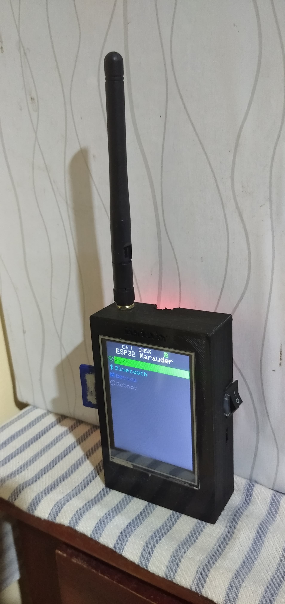

##This is an Old Hardware Edition
This fork is optimized for ESP32 boards with limited RAM/flash and basic displays like ILI9341. All unnecessary features and heavy dependencies were removed to fit and perform better on older ESP32 modules.

##Device Preview

  

